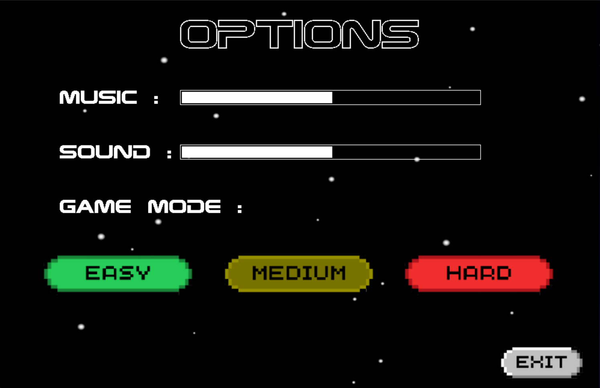

# Among us Jump
- Cấu trúc code và thử nghiệm game: 
- Gameplay: 

## Giới thiệu 
Among us Jump là game với lối chơi vui và hài hước. Nhập vai vào nhân vật Among us, bạn hãy cố gắng
di chuyển để né những kẻ địch đang lao tới, và cố gắng thu thập những item để cản trở những kẻ địch đó.
- [0. Cách tải game](#0-cách-tải-game)
- [1. Bắt đầu game](#1-bắt-đầu-game)
- [2. Các thành phần trong game](#2-các-thành-phần-trong-game)
  * [a. Người chơi](#a-người-chơi)
  * [b. Kĩ năng](#b-kĩ-năng)
  * [c. Kẻ địch](#c-kẻ-địch)
  * [d. Boss](#d-boss)
- [3. Điều khiển](#3-điều-khiển)
- [4. Chiến thắng và thất bại](#4-chiến-thắng-và-thất-bại)
- [5. Về source code của game](#5-về-source-code-của-game)

## 0. Cách tải game
### a. Cách 1 : không bao gồm code 
**Tải game theo file .zip tại link sau : https://github.com/thaihoc285/amongus_jump/releases/tag/download**
*(khoảng 40mb)*
**Sau đó giải nén game vào một thư mục và bật amongus_jump.exe lên và chơi**

### b. Cách 2: Bao gồm code (tải lâu và nặng hơn)
* chọn **<> Code** màu xanh lá cây ở trên
* Sau đó có thể clone repo này về bằng cách chọn thư mục muốn lưu, mở cmd lên và nhập : **git clone https://github.com/thaihoc285/amongus_jump.git**
* Hoặc nhấn vào **Download Zip**

* Bật amongus_jump.exe lên và chơi
## 1. Bắt đầu game
- Màn hình chính:

- Click vào nút **SINGERPLAYER** để chọn chế độ 1 người chơi. Trong chế độ này bạn phải cố gắng để sống sót lâu nhất.

- Chọn "MULTIPLAYER" để vào những chế độ 2 người chơi:

 
- Có 2 chế độ: 
  * TWO PLAYERS : 2 người chơi cố né tránh xem ai sống lâu hơn **và có thể tiêu diệt nhau**
  * PLAYER VS AI (**beta**): bạn sẽ đấu với AI **nhưng trong chế độ này không có boss**

- Chọn "HIGHSCORE" để xem bảng xếp hạng xem thời gian lâu nhất có thể sống sót là bao lâu

- Chọn "OPTIONS" để điều chỉnh:

  * MUSIC : gồm những âm thanh nền
  * SOUND : gồm những âm thanh hiệu ứng
  * GAMEMODE : có thể tuỳ chỉnh độ khó, **mới đầu vào game sẽ tự được chỉnh là medium**
- Bố cục cơ bản (khi chơi SINGERPLAYER):

## 2. Các thành phần trong game
### a. Người chơi
- SPIDERMAN : là nhân vật do người chơi 1 điều khiển, bị chết nếu va chạm vào các kẻ địch hoặc bị nhân vật khác tiêu diệt trong multiplayer
- CAPTAIN : là nhân vật do người chơi 2 điều khiển, bị chết nếu va chạm vào các kẻ địch hoặc bị nhân vật khác tiêu diệt trong multiplayer
- AI : là nhân vật tự di chuyển khi đến gần kẻ địch , bị chết nếu va chạm vào kẻ địch, xuất hiện trong chế độ PLAYER VS AI.
*Vẫn đang thử nghiệm nên AI di chuyển chưa được tối ưu*
- MONSTER : là nhân vật khi người chơi ăn kĩ năng monster , sẽ di chuyển chậm hơn nhưng sẽ ăn thịt được 1 kẻ địch (trừ boss) và có thể ăn người chơi khác trong chế độ TWO PLAYERS để chiến thắng luôn (bạn sẽ ở trạng thái này vĩnh viễn đến khi cắn 1 ai đó)
- GHOST : là nhân vât khi người chơi ăn kĩ năng ghost trong game , sẽ bất tử khỏi bất kỳ mối hiểm hoạ nào trong vòng 4s
### b. Kĩ năng
Trong game sẽ có 4 kĩ năng được random ra trong khoảng thời gian nhất định tuỳ vào độ khó :
|                                                   | Tên kĩ năng  | Chức năng                                                                                                 | 
|---------------------------------------------------|--------------|----------------------------------------------------------------------------------------------------------|
|   | Bomb	       | Mỗi khi nhân vật ăn kĩ năng này thì sẽ tạo ra 1 vùng nổ nhỏ xung quanh để tiêu diệt các enemy (ngoại trù boss) |
|     | Monster	   | Khi nhân vật ăn sẽ biến thành nhân vật [MONSTER](#a-người-chơi) |
|   | Nogravity    | Mỗi khi nhân vật ăn kĩ năng này sẽ không bị tác động bởi trọng lực |
|   | Ghost        | Khi nhân vật ăn sẽ biến thành nhân vật [GHOST](#a-người-chơi) |

>*hãy sử dụng các kĩ năng 1 cách hợp lí vì chúng sẽ không mất đi trừ khi bị nhân vật ăn*

### c. Kẻ địch
Trong game sẽ có 6 kẻ địch với cách di chuyển khác nhau cùng với độ nguy hiểm khác nhau :
|                                                           | Độ nguy hiểm | Mô tả                                                                     |
|-----------------------------------------------------------|--------------|---------------------------------------------------------------------------|
|   | Easy	       | Di chuyển khá chậm nên dễ đoán hướng đi                                   |
|   | Easy	       | Di chuyển chậm nhất, một số trường hợp khá nguy hiểm do cái chậm đấy |
|     | Medium	   | Di chuyển tầm trung nhưng cũng dễ đoán hướng đi                           |
|     | Medium	   | Di chuyển nhanh nên khá nguy hiểm                                     |
|    | Hard	       | Di chuyển 2 bên nên sẽ ngăn chặn nhân vật đứng dưới đất                   |
|      | Hard	       | Di chuyển nhanh nhất trong game , nhanh hơn khá nhiều so với nhân vật     |

>*tuỳ thuộc vào độ nguy hiểm của kẻ địch mà dùng các kĩ năng tiêu diệt kẻ địch hợp lí*
### d. Boss
Boss trong game là những kẻ địch nhưng to hơn rất nhiều và di chuyển cũng nhanh hơn,thường có 1 số lần nảy nhất định trong game rồi sẽ đi ra khỏi màn hình :

>***Boss không thể bị tiêu diệt bởi bất cứ thứ gì nên hãy cố né nhất có thể***
## 3. Điều khiển
- NHÂN VẬT 1
 * nhảy : phím **↑** ,có thể nhảy nhiều lần nhưng không thể dí nút nhảy
 * sang trái , sang phải : các phím **←, →** , có thể dí 2 nút này 
 * xuống : phím **↓** , dùng khi nhân vật ở trên khoảng không và muốn xuống đất nhanh hơn trọng lực
- NHÂN VẬT 2 (chế độ TWO PLAYERS)
 * nhảy : phím **W**
 * sang trái , sang phải : các phím **A, D**
 * xuống : phím **S**
## 4. Chiến thắng và thất bại
- Tất nhiên khi chơi chế độ SINGERPLAYER sẽ không có chiến thắng mà chỉ đua top trên highscore nên đây là màn hình khi thua :

- Khi chơi chế độ MULTIPLAYER khi 1 người chiến thắng (khi người còn lại bị chạm trúng kẻ địch hoặc bị người kia cắn khi đang trong dạng MONSTER) : 

## 5. Về source code của game
- main.cpp: Hàm main của trò chơi
- blockgame.cbp : project file
- Folder fonttext: chứa các kiểu chữ được dùng trong trò chơi
- Folder image: chứa các ảnh được dùng trong trò chơi
- Folder background:
  * background: quản lí background của trò chơi 
- Folder games:
   * game : xử lí các sự kiện , hoạt động trong game
   * gameconstants : quản lí các biến môi trường
- Folder characters:
   * character : quản lí các nhân vật trong trò chơi
   * enemy : quản lí các kẻ địch trong trò chơi 
   * bigenemy : quản lí boss trong trò chơi
   * ai : quản lí nhân vật AI trong trò chơi 
- Folder items:
   * skill : quản lí các kĩ năng trong trò chơi 
   * explosion : xử lí hiệu ứng nổ 
   * monster : xử lí biến hình khi ăn kỹ năng monster
   * nogravity : xử lí khả năng bay ,không ảnh hưởng bởi trọng lực
   * invisible : xử lí biến hình khi ăn kỹ năng ghost

---
Nguồn tham khảo hình ảnh : [Pinterest](pinterest.com)